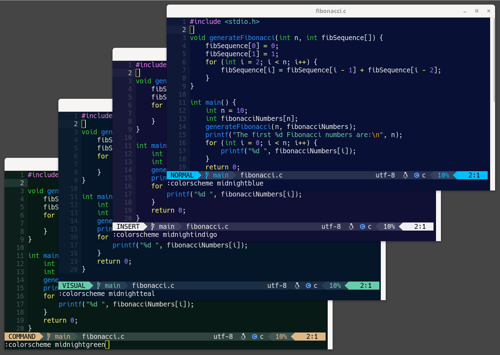

# MidnightBlue Colorscheme

A colorful scheme with a dark midnightblue background for Vim and Neovim

### Variants

Four background color variants are available:
- midnighblue (dark blue)
- midnightindigo (dark indigo)
- midnightteal (dark teal)
- midnightgreen (dark green)

### Supported plugins

- Vim: GitGutter, airline
- Neovim: GitSigns, lualine, Treesitter, LSP, Indent Blankline, NeoTree,
  Telescope

### Install

Install using a plugin manger by adding
`dam9000/colorscheme-midnightblue`
to the list of plugins.

Example:

- Vim Vundle:

  `Plugin 'dam9000/colorscheme-midnightblue'`

- Neovim lazy.vim:

  `{ 'dam9000/colorscheme-midnightblue' }`

Enable the colorscheme with:

  `:colorscheme midnightblue`

And the statusline theme with:

- airline:

  `:AirlineTheme midnightblue`

- lualine:

  `require'lualine'.setup({options={theme='midnightblue'}})`

### Options

- Transparent background: `g:midnightblue_transp_bg`

Set to 1 to enable transparent background.

Example for Vim:

`let g:midnightblue_transp_bg = 1`

Example for Neovim:

`vim.g.midnightblue_transp_bg = 1`

(Note: all color variants use the same option name)

